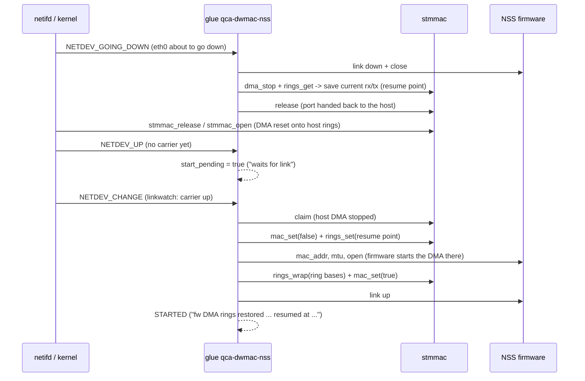

# The trunk-bounce fix — design

Root cause, measurements, and the investigation that led here: [`trunk-bounce-investigation.md`](trunk-bounce-investigation.md),
[`trunk-bounce-measurements.md`](trunk-bounce-measurements.md). Test record: [`testing.md`](testing.md).

## The problem in one sentence

The NSS firmware points the dwmac1000 DMA at its own descriptor rings only on the **first** open of a GMAC after
boot. A later open neither reprograms the ring list addresses nor rewinds the firmware's own ring indices — it
expects the DMA to continue exactly where it stopped. Any host-side close/open in between (`stmmac_open`) resets
the DMA onto the host's own rings instead. Result: after any interface bounce, the cable stops passing traffic
until reboot.

What bounces the interface with the system running: `netifd` rebuilding `br-lan` — LuCI "Save & Apply" of a bridge
option, `/etc/init.d/network reload` with a LAN change — bounces the DSA conduit (`eth0`, GMAC0, `phys_if 0`);
`ip link set wan down/up` or a change to the `wan` device bounces GMAC1 (`phys_if 1`); an MTU change that forces
`eth0` to change size makes `stmmac` reopen the DMA on its own.

## Symptom (measured)

A config change that makes `netifd` rebuild the LAN bridge → `eth0` (the DSA conduit) drops and comes back → the
`qca-dwmac-nss` glue releases and reclaims the port (`qca-dwmac: data plane released, bounce the interface to
restore host DMA` / `data plane claimed` / `phys_if 0 on NSS fw data plane`) → the `qca-dsa-nss` glue swaps its
internal node → **traffic entering over the cable never reaches the system** (100% ping loss from a peer on the
cable; DHCP requests from that peer never reach `dnsmasq`) until reboot. Wi-Fi keeps working the whole time.

## Cause (measured)

See [`trunk-bounce-measurements.md`](trunk-bounce-measurements.md) for the raw register dumps and counters. In
short: on the broken port, the DMA's RX/TX descriptor-list-address registers pointed at the host `stmmac` driver's
own rings, not at the firmware's `gmac_{rx,tx}_desc_N` rings from the NSS `meminfo`. Frames arrived at the MAC and
were counted, but landed in host descriptors nobody reads; nothing was ever transmitted, even though the firmware
kept counting redirected packets. Writing only the ring *base addresses* back was not enough: the firmware
continued from its own last index (measured at RX descriptor 7, TX descriptor 16) while the DMA restarted at
descriptor 0, and the TX ring deadlocked waiting for a descriptor the firmware would never reach.

## API added by patch `0958`

Declared in `qca_dwmac.h`, implemented in `stmmac_main.c` right after `qca_dwmac_dp_rx_kick()`. All of these
require the netdev to be claimed (`priv->dp_owner` set) and all but `_get()` require `rtnl`.

| Function | Does | Fails |
|---|---|---|
| `qca_dwmac_dp_rings_get(dev, &r)` | Reads `rx_base`/`tx_base` (registers `0x100c`/`0x1010`), `rx_cur`/`tx_cur` (`0x104c`/`0x1048`), and where the host's own `stmmac` rings live (`dma_conf.rx_queue[0].dma_rx_phy`, `tx_queue[0].dma_tx_phy`) | `-EINVAL` |
| `qca_dwmac_dp_dma_stop(dev)` | Calls `stmmac_stop_all_dma()` and waits for both DMA processes to report stopped (RS=0, TS=0; up to 100 × 100–200 µs) | `-EPERM` without a claim; `-EBUSY` if it doesn't stop |
| `qca_dwmac_dp_rings_set(dev, rx, tx)` | With the DMA stopped, writes the list-address registers; the next start resumes from there | `-EPERM`; `-EBUSY` if the DMA is not stopped |
| `qca_dwmac_dp_rings_wrap(dev, rx, tx)` | Waits for both DMA processes to report started (RS≠0, TS≠0), then writes the list-address registers; this only takes effect the next time the ring wraps | `-EPERM`; `-EBUSY` if the DMA hasn't started |
| `qca_dwmac_dp_mac_set(dev, bool)` | Enables/disables MAC RX and TX (`stmmac_mac_set()`) | none (silently ignored without a claim) |

Hardware facts this API relies on, all measured (see `trunk-bounce-measurements.md` §3): a DMA start loads its
current-descriptor pointer from the list-address register; a write to the list-address register while the DMA is
running only takes effect the next time the ring wraps around; the end-of-ring descriptor bit belongs to the
firmware's ring layout, so the ring keeps its original length across a resume.

## Glue flow (`qca_dwmac_nss.c`)

Port states: `IDLE → ARMED → OVERRIDDEN → STARTED` (`enum dwmac_nss_port_state`). Fields the fix adds to
`struct dwmac_nss_port`: `start_pending`; `fw_rx_ring`/`fw_tx_ring`/`fw_rings_known` (the firmware's ring base
addresses, learned on the first open and kept for the life of the boot); `fw_rx_resume`/`fw_tx_resume`/
`fw_resume_valid` (the resume point); `ring_restores` (a counter, visible in the debugfs status).



Code, with line numbers from the current tree:

- `dwmac_nss_rings_save()` (line 338): called from `dwmac_nss_port_unwind()` right after the firmware `close`,
  only while the firmware is alive; saves the resume point if (and only if) the DMA was still on the firmware's
  own rings when it stopped.
- `dwmac_nss_rings_prepare()` (line 366): the first thing `dwmac_nss_port_start()` does after the claim (line
  433/447). On the very first open after boot it does nothing (the firmware programs its own rings); with no
  saved resume point it restarts at the ring base and logs a warning.
- `dwmac_nss_rings_start()` (line 398): runs after a successful firmware `open` (called from `port_start`, line
  466). On the first open it records the firmware's ring addresses (refusing values that match the host's own
  rings); on later opens it writes the real ring base back for the wrap and re-enables the MAC if carrier is up.
- `dwmac_nss_port_start_on_link()` (line 523): starts the port immediately if carrier is up, otherwise sets
  `start_pending`. Used at boot (`nss_dp_start_data_plane()`), on `NETDEV_UP`, and on `NETDEV_CHANGE` (only if
  `start_pending`).
- Notifier `dwmac_nss_netdev_event()` (line 1195): the event filter (before the lock is taken) now also passes
  `NETDEV_CHANGE` and `NETDEV_PRECHANGEMTU`. `NETDEV_GOING_DOWN` and `NETDEV_PRECHANGEMTU` both clear
  `start_pending` and unwind `STARTED → OVERRIDDEN`; `NETDEV_CHANGEMTU` with the port `OVERRIDDEN` calls
  `start_on_link()` again.

### Why each part exists

- **Resume point, not just the base address:** the firmware continues its own indices; restarting the DMA at
  descriptor 0 deadlocks TX (measured: firmware waiting at 7/16, DMA restarted at 0).
- **MAC gated off between the DMA start and the ring-base wrap write:** if a burst of traffic wraps the ring
  before the real base address is written back, the DMA wraps to the *resume point* and skips every descriptor
  between 0 and there — deadlock. With the MAC gated, no frame can enter during that window (a few milliseconds,
  with the link already up).
- **Wait for carrier before starting the firmware plane:** this is kuncy7's own rule for the boot path ("arming on
  a down interface: … not one ingress frame is ever delivered"), already applied there by `nss-dwmac-up`. It is
  not the root cause of the trunk-bounce bug, but it closes a second, independent failure mode when a bounced
  trunk comes back up before the link is actually there (measured on the AX6000: claimed at one point in time,
  link only up a couple of seconds later, with zero ingress on the wired ports in between until reboot).
- **`start_pending` re-armed only by a carrier event, no retry:** a start that failed has already handed the port
  back to the host. Retrying on every subsequent carrier event would park the host DMA against a firmware that
  stays dead, in a loop, extending an outage instead of ending it.
- **`NETDEV_PRECHANGEMTU` hands the port back:** `stmmac_change_mtu()` on a running interface calls
  `__stmmac_release()` + `__stmmac_open()` directly, without going through `NETDEV_GOING_DOWN`/`NETDEV_UP`. On a
  claimed port that would call `napi_disable()` on NAPI queues the claim already disabled — a permanent deadlock
  with `rtnl` held (measured by the author of the preceding claim/release patch on a reboot path; not reproduced
  in this investigation) — and would leave the DMA on brand-new host rings. Handing the port back first avoids
  both; `NETDEV_CHANGEMTU` brings the firmware plane back once the new MTU is in effect.
- **The event filter and the lock:** the filter that runs before `dwmac_nss_lock` is taken exists because
  `netdev_update_features()` inside `port_start` fires `NETDEV_FEAT_CHANGE` synchronously while the lock (and
  `rtnl`) are held — taking the lock again in the notifier deadlocks (measured by kuncy7, on the original claim
  code). `NETDEV_CHANGE` is safe to let through: every synchronous caller of it (`linkwatch_sync_dev` from sysfs,
  ethtool, netlink, or unregister; `__dev_notify_flags`) runs outside the glue's own locked sections, and the
  normal path — the kernel's linkwatch worker — takes `rtnl` on its own. `NETDEV_PRECHANGEMTU`: no glue code path
  ever changes an MTU itself. The glue's own restore bounce (`dwmac_nss_host_restore`) is separately guarded by
  `dwmac_nss_in_restore`, which makes the notifier ignore events it generates itself.

## Checking the state on a running router

`/sys/kernel/debug/qca-dwmac-nss/status`, per port:

```
phys_if 0: started dev=eth0 fw_link=up[ (notify-failed)][ (waiting for link)]
  tx_redirect=… tx_busy=… rx_fw=… link_changes=… link_skipped=…
  dma_status=00660004 rs=3 ts=6 ru=0 tu=1 rx_kicks=0
  rings rx=<base> tx=<base> cur rx=<current> tx=<current> host rx=<stmmac> tx=<stmmac> fw known rx=<fw> tx=<fw> resume rx=<…> tx=<…>[ (pending)] restores=<n>
```

Healthy: `rx`/`tx` equal `fw … rx`/`tx` and differ from `host`. Broken (the old bug): `rx`/`tx` equal `host`.
`(pending)` on the resume fields means a resume point was saved and not used yet (the port is waiting for carrier).

## dmesg messages

| Message | Meaning |
|---|---|
| `phys_if N waits for link before the NSS fw data plane` | Port came up without carrier; will start on the next `NETDEV_CHANGE` |
| `fw DMA rings of phys_if N: rx … tx …` | First open after boot; firmware's ring addresses recorded |
| `fw DMA rings restored on phys_if N, resumed at rx … tx …` | A correct reopen |
| `phys_if N has no resume point, fw DMA rings restart at their base` | ⚠️ reopening at the ring base instead of a resume point — can deadlock TX |
| `phys_if N DMA did not stop (…), no resume point` / `DMA not on the fw rings at close …` | ⚠️ could not capture a resume point on close |
| `fw DMA rings not restored on phys_if N (…)` | ⚠️ `rings_set` failed — port handed back to the host (this is the old bug reappearing) |
| `phys_if N DMA not started by the fw open (…)` | ⚠️ firmware did not start the DMA in time after `open` |
| `fw open left phys_if N on the host DMA rings …` | ⚠️ the very first open never got the firmware's own rings; every later reopen falls back to the pre-fix behavior |

## Debugging guide, if this regresses

1. Read the glue's `status`: is `rings rx/tx` equal to `host`? Did `restores` fail to increase? Is there a ⚠️
   warning above in dmesg?
2. Run `ethtool -S eth0` twice while traffic is entering: `mmc_rx_framecount_gb` and `q0_rx_irq_n` rising together
   means frames are arriving and landing in the host's own ring; `mmc_tx_framecount_gb` frozen means nothing is
   being transmitted.
3. Compare `ethtool -d eth0` (the DMA register section) against
   `/sys/kernel/debug/stmmaceth/eth0/descriptors_status` and `/sys/kernel/debug/qca-nss-drv/meminfo/core0`.
4. For the descriptor ownership map itself: load the `gmacreg` bench module and run
   `tools/ringdump.sh 0 <rx-base> <tx-base>` (procedure in [`lab.md`](lab.md)).

## Maintenance

Merge/rebase procedure and the specific files to re-check on a kuncy7 update are in the top-level
[`README.md`](../README.md#keeping-the-changes-when-updating-from-kuncy7). Before flashing any change that
touches this code, boot from RAM and run at least test T2 and the 1 s stress run from [`testing.md`](testing.md).

## Known limits

- **MTU above the TX FIFO:** `tx_fifo_size` (16383 bytes) divided across the queues sets a ceiling `stmmac` checks
  before reopening. If an MTU change is refused there, the glue has already handed the port back — the cable stays
  down until the next link drop. Only reachable with jumbo frames.
- **`rings_set` failing on reopen:** falls back to the pre-fix error path (`err_release` →
  `dwmac_nss_host_restore`), which bounces `eth0` down/up. On the `dsa` topology that also drops `lan1`–`lan3`
  (`netifd` does not bring them back on its own). Not observed in any test run so far.
- **Not tested:** the cable being unplugged and replugged while the firmware owns the port — that only exercises
  `link_state`, a path that never touches the DMA, so it should be unaffected, but it has not been measured;
  accelerated IPv6 through a resumed port; long-term stability of the fix in flash; the glue never getting
  `fw_rings_known` in the first place (if the firmware's very first open after boot ever failed, every later
  reopen would fall back to the pre-fix behavior, with a dmesg warning).
